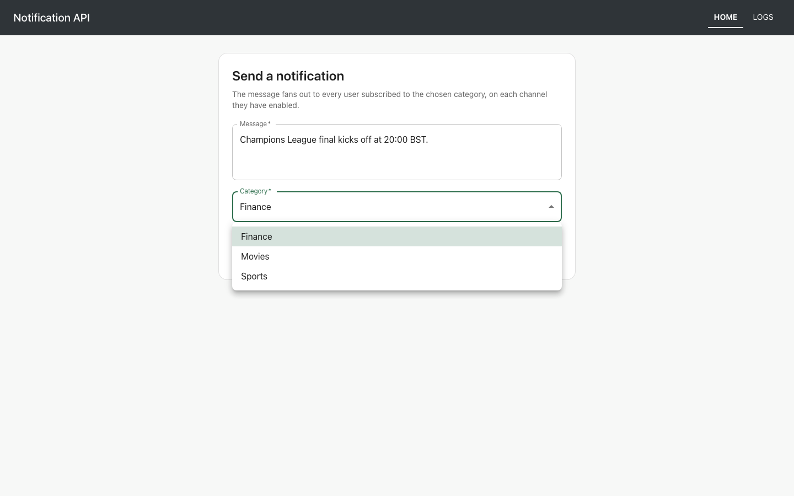
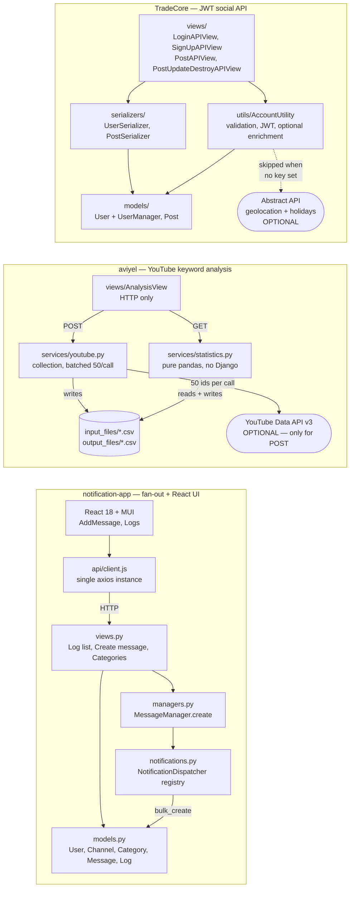
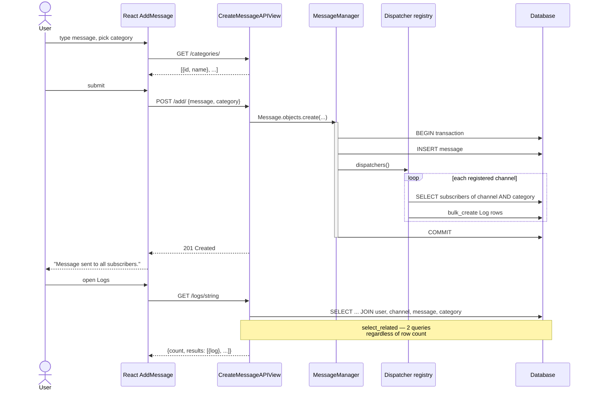

# code-samples

Three independent backend samples, each originally written as a take-home
submission, kept in one repository as a portfolio index. They do not share a
database, a settings module, or a deployment — each directory is a complete
project that you clone, install and run on its own.

The common thread is Django REST Framework: the samples differ in what sits
behind it (a JWT-authenticated CRUD API, a pandas analysis pipeline, and a
notification fan-out engine with a React front-end), which is the point of
having all three in one place.

| Sample | What it demonstrates | Stack | Tests | UI |
|---|---|---|---|---|
| [`TradeCore/`](TradeCore/tradecore) | JWT auth, ownership-scoped CRUD, optional third-party enrichment that degrades gracefully | Django 4.0, DRF, PyJWT, SQLite | 48 | No — API only |
| [`aviyel/`](aviyel/aviyel_api) | Batched third-party data collection, pandas analysis split from I/O, CSV reporting | Django 4.0, DRF, pandas, YouTube Data API | 27 | No — API only |
| [`notification-app/`](notification-app) | Plugin-style dispatcher registry, fan-out on write, N+1-free log reads | Django 4.1, DRF, React 18, MUI 5 | 21 + 14 | Yes |

**110 tests across the three samples, all passing.** None of them makes a
network call or needs an API key.

---

## Captured output

### notification-app (the one with a UI)

Send a message, and it fans out to every user subscribed to that category on
each channel they have enabled.


Categories are fetched from the API rather than hardcoded:



The resulting delivery log — one row per (user, channel) pair:


### TradeCore and aviyel (no UI)

Both are APIs, so the evidence is a real transcript rather than a screenshot:

- [`TradeCore/docs/api-walkthrough.md`](TradeCore/docs/api-walkthrough.md) —
  signup → login → create → list → like → update → delete, including the
  authorisation failures, captured against a fresh database with no API keys set.
- [`aviyel/docs/analysis-run.md`](aviyel/docs/analysis-run.md) — an analysis run
  over the committed 350-video dataset, with the generated CSVs inline.

A fragment of the aviyel run:

```console
$ curl -s 'http://localhost:8612/analysis/?keyword=travel'
{"message":"Analysis complete for 'travel'.","videos_analysed":350,"categories":15,
 "files":["number_of_videos.csv","min_max_tag_videos.csv","average_durations.csv",
          "min_max_tag_durations.csv","classified_tags.csv"]}
```

---

## Architecture

This repository is a collection, not a system. The diagram below is a map of
what each sample contains and where its layers sit — there is deliberately no
arrow between the three, because none exists in the code.



Each sample follows the same layering rule: **HTTP handlers stay thin, the work
lives one layer down, and nothing below the service layer imports a request.**
That is what makes `AccountUtility`, `statistics.py` and `NotificationDispatcher`
testable without a client.

## Workflow

The notification fan-out is the most interesting flow in the repository, because
one write triggers a variable amount of work:



---

## Quickstart

Each sample is independent. Pick one:

```bash
# TradeCore — JWT social API
cd TradeCore/tradecore
python -m venv .venv && source .venv/bin/activate
pip install -r requirements.txt
python manage.py migrate
python manage.py runserver          # http://localhost:8000/api

# aviyel — YouTube keyword analysis
cd aviyel/aviyel_api
python -m venv .venv && source .venv/bin/activate
pip install -r requirements.txt
python manage.py migrate
python manage.py runserver
curl 'http://localhost:8000/analysis/?keyword=travel'   # works with no API key

# notification-app — fan-out engine + React UI
cd notification-app/notificationAPI
python -m venv .venv && source .venv/bin/activate
pip install -r requirements.txt
python manage.py migrate
python manage.py seed_demo --messages 4    # channels, categories, 3 users, data
python manage.py runserver

# ...and in a second terminal:
cd notification-app/notificationFrontend
npm install
npm start                            # http://localhost:3000
```

Every sample runs with **no API keys set**. The optional third-party
integrations degrade rather than fail — see Configuration.

### With Docker

```bash
docker compose up                    # all four services
docker compose up tradecore          # or just one
```

| Service | Host port |
|---|---|
| `tradecore` | 8611 |
| `aviyel` | 8612 |
| `notification-api` | 8613 |
| `notification-frontend` | 8614 |

> The Docker files are authored and `docker compose config` parses cleanly, but
> the images have **not been built or booted** — see Limitations.

---

## Configuration

Every sample reads configuration from the environment and ships a `.env.example`.
No sample requires a value to start.

### TradeCore (`TradeCore/tradecore/.env`)

| Variable | Required | Default | Purpose |
|---|---|---|---|
| `SECRET_KEY` | No (yes in production) | `dev-only-insecure-key-change-me` | Django signing key; also signs the API's JWTs |
| `DJANGO_DEBUG` | No | `1` | Debug mode. Set `0` outside development |
| `ALLOWED_HOSTS` | No | empty | Comma-separated hostnames |
| `ABSTRACT_GEOLOCATION_API_KEY` | No | empty | Geolocates the signup IP. **Unset ⇒ lookup skipped, no network call** |
| `ABSTRACT_HOLIDAYS_API_KEY` | No | empty | Flags signups on a public holiday. **Unset ⇒ skipped** |
| `ABSTRACT_API_TIMEOUT` | No | `5` | Per-request timeout in seconds |

### aviyel (`aviyel/aviyel_api/.env`)

| Variable | Required | Default | Purpose |
|---|---|---|---|
| `SECRET_KEY` | No (yes in production) | `dev-only-insecure-key-change-me` | Django signing key |
| `DJANGO_DEBUG` | No | `1` | Debug mode |
| `ALLOWED_HOSTS` | No | empty | Comma-separated hostnames |
| `GOOGLE_API_KEY` | No | empty | YouTube Data API v3 key. **Only needed to collect new data (POST); analysis of the committed dataset works without it** |

### notification-app API (`notification-app/notificationAPI/.env`)

| Variable | Required | Default | Purpose |
|---|---|---|---|
| `SECRET_KEY` | No (yes in production) | `dev-only-insecure-key-change-me` | Django signing key |
| `DJANGO_DEBUG` | No | `1` | Debug mode |
| `ALLOWED_HOSTS` | No | empty | Comma-separated hostnames |
| `CORS_ALLOWED_ORIGINS` | No | `http://localhost:3000,http://localhost:8614` | Browser origins allowed to call the API |
| `PAGE_SIZE` | No | `50` | Log entries per page |

### notification-app front-end (`notification-app/notificationFrontend/.env.local`)

| Variable | Required | Default | Purpose |
|---|---|---|---|
| `REACT_APP_API_URL` | No | `http://localhost:8000/` | Base URL of the API, trailing slash included |

---

## Development

```bash
# Tests — run from each sample's manage.py directory
python manage.py test              # TradeCore: 48, aviyel: 27, notification: 21

# Front-end tests
cd notification-app/notificationFrontend && npm run test:ci    # 14

# Formatting — configured once at the repository root in pyproject.toml
black .
pycodestyle .                      # settings in setup.cfg
```

Formatting and linting are configured once at the root (`pyproject.toml`,
`setup.cfg`, `.editorconfig`) and apply to all three samples. Migrations are
excluded from both.

---

## Project structure

```
code-samples/
├── pyproject.toml              # black + isort, shared by all Python samples
├── setup.cfg                   # pycodestyle
├── .editorconfig
├── docker-compose.yml          # all four services, host ports 8611-8614
│
├── TradeCore/tradecore/        # Sample 1 — JWT social API
│   ├── tradecore/settings.py
│   ├── tradecore_api/
│   │   ├── models/             # User (custom manager), Post
│   │   ├── serializers/
│   │   ├── views/              # one file per endpoint, thin
│   │   ├── utils/              # AccountUtility: JWT, validation, enrichment
│   │   └── tests/              # 48 tests, factories included
│   └── docs/api-walkthrough.md # captured request/response transcript
│
├── aviyel/aviyel_api/          # Sample 2 — YouTube keyword analysis
│   ├── analysis/
│   │   ├── views.py            # HTTP only
│   │   ├── services/
│   │   │   ├── youtube.py      # all Google API access, batched
│   │   │   └── statistics.py   # pure pandas, no Django import
│   │   └── tests.py            # 27 tests
│   ├── aviyel_api/
│   │   ├── input_files/        # travel.csv — 350 real rows, committed
│   │   └── output_files/       # generated at runtime
│   └── docs/analysis-run.md
│
└── notification-app/           # Sample 3 — fan-out + React UI
    ├── notificationAPI/
    │   └── main/
    │       ├── models.py       # User, Channel, MessageCategories, Message, Log
    │       ├── managers.py     # fan-out on create, in a transaction
    │       ├── notifications.py# dispatcher registry — the extension point
    │       ├── views.py        # select_related log listing
    │       ├── management/commands/seed_demo.py
    │       └── tests.py        # 21 tests
    ├── notificationFrontend/
    │   └── src/
    │       ├── api/client.js   # single axios instance, one base URL
    │       ├── components/     # AddMessage, Logs, Navbar
    │       └── App.test.js     # 14 tests
    └── docs/screenshots/
```

---

## Design notes

### Why this repository is not one application

The three directories were separate submissions with separate briefs. Merging
them behind a shared settings module or a single database would misrepresent
what they are and destroy the thing that makes them useful — each is a small,
complete, readable project. So the uplift here was to make each one genuinely
runnable and self-documenting, and to let this README act as the index.

### Optional integrations must degrade, not fail

All three samples originally treated a third-party API as mandatory, and all
three were unusable without a paid key:

- **TradeCore** called Abstract's geolocation API during signup and wrote the
  result into a non-nullable `JSONField`. With no key the call returned nothing,
  the field failed validation, and **every signup returned HTTP 400** — you could
  not create a single user from a fresh clone.
- **aviyel** built its Google API client at *module import*, so an absent key
  raised `DefaultCredentialsError` before Django finished loading.
  `manage.py check`, `test` and `runserver` all crashed.
- The front-end read `process.env.REACT_APP_API_URL` with no fallback and no
  committed `.env`, so it issued requests to the literal URL `undefinedadd/`.

Each now has an explicit "not configured" path: the lookup is skipped entirely
(no wasted network call), the API returns a 503 that names the missing variable,
and the client falls back to a working default. This is why the test suites need
no keys and make no network calls.

### The real bottlenecks

Each sample had a different one, and each is addressed where it actually was:

**aviyel — a 700-call collection loop.** Collecting one keyword issued one
`videos.list` *and* one `videoCategories.list` request per video, sequentially:
about 700 HTTP round-trips for the 350-video dataset. The YouTube API accepts 50
ids per call, and the ~15 distinct category names were being re-fetched hundreds
of times. Batching by 50 and de-duplicating categories takes the same collection
to **at most 7 search + 7 detail + 1 category = 15 calls** — a reduction of
roughly 98%, asserted in `test_video_details_are_requested_in_batches_of_fifty`
and `test_category_names_are_deduplicated_before_fetching`. The analysis side
also stopped rescanning the whole frame once per category in favour of a single
`groupby` aggregate.

**notification-app — an unbounded N+1 on every log read.** `Log.objects.all()`
was serialized with `depth=1`, and the string serializer's `get_log()` walks
`user`, `channel`, `message` and `message.category`. That is four extra queries
per row, over a table that grows by (subscribers × channels) on every message,
with no pagination. Adding `select_related` on all four relations plus
`PageNumberPagination` makes it **2 queries regardless of row count** — asserted
in `test_log_listing_does_not_scale_queries_with_row_count`, which grows the
table from 4 to 44 rows and requires the query count to be unchanged. The
fan-out itself also moved from a `create()` per recipient to one `bulk_create`.

**TradeCore — unbounded list, plus a blocking third-party call on signup.**
Listing posts now uses `select_related` and a 100-row cap
(`test_list_query_count_does_not_grow_with_row_count` grows 3 → 30 rows and
holds the count at 2). The enrichment calls gained an explicit timeout and are
skipped when unconfigured, so signup no longer blocks on a third party.

### The one extension seam worth having

`notification-app` already had the best idea in the repository: `MessageManager`
discovers dispatchers via `NotificationDispatcher.__subclasses__()`, so a new
channel needs no registration call. Two things were wrong with it — it only
found *direct* subclasses, and each subclass restated its channel name in an
overridden method. Now a dispatcher is a subclass with a `channel_name`
attribute, and discovery recurses:

```python
class WebhookDispatcher(NotificationDispatcher):
    channel_name = "Webhook"
```

That is the whole change needed to add a channel; `test_a_new_subclass_is_picked_up_automatically`
and `test_nested_subclasses_are_found` hold the contract.

### Deliberately no AI features and no new product features

All three samples are assessment submissions. Adding an LLM summariser or a
dashboard would read as scope creep against the original brief and would make
the code harder, not easier, for a reviewer to assess. The only additions are
ones that fix something broken or make the sample runnable: a `seed_demo`
command (the README claimed data shipped in a `db.sqlite3` that is git-ignored
and was never committed) and a `/categories/` endpoint (the form hardcoded
category ids 1/2/3, which point at the wrong rows in any database where the
categories were created in a different order).

---

## Limitations

- **The Docker images have not been built or booted.** `docker compose config`
  parses cleanly, but the daemon was unavailable in this environment, so the
  Dockerfiles are unverified beyond parsing.
- **Every sample uses SQLite** and Django's development server. Neither belongs
  in production; the samples are sized to demonstrate design, not to be deployed.
- **`aviyel`'s committed `travel.csv` is skewed.** It was collected by the
  original code, which searched the requested keyword only on the first page and
  a hardcoded unrelated string on the remaining six. Only 29 of its 350 rows are
  actually `Travel & Events`. The bug is fixed, but regenerating the dataset
  needs a YouTube API key, so the original file is kept as-is and labelled.
- **`notification-app` does not really send anything.** A dispatcher writes a
  `Log` row; there is no SMS, e-mail or push provider behind it. The fan-out is
  also synchronous inside the request — correct at demo scale, but real delivery
  belongs on a queue.
- **TradeCore pins PyJWT 1.7.1 and `djangorestframework-jwt`**, both unmaintained.
  Upgrading means changing the token format, which would alter the submission's
  documented API contract, so the pins are unchanged and called out here instead.
- `aviyel`'s analysis reads the whole CSV into memory. Fine for hundreds of rows,
  wrong for millions.
- There is no CI configuration; the suites are run manually.
