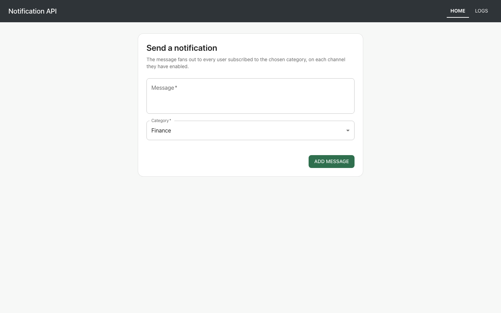
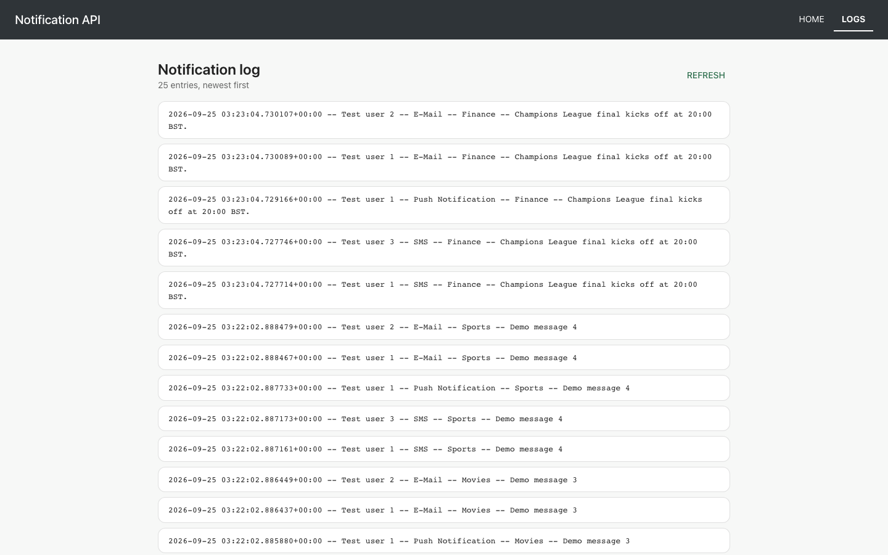

# Notification API

Send a message to a category, and it fans out to every user subscribed to that
category, on each channel they have enabled. A `Log` row records every
(user, channel, message) delivery. A small React UI posts messages and reads the
log back.

Part of [`code-samples`](../README.md).

## Stack

- **Backend:** Python 3.10, Django 4.1, Django REST Framework, SQLite
- **Frontend:** React 18, MUI 5, axios, React Router 6

## Screenshots




## Setup

### Backend

```bash
cd notificationAPI
python -m venv .venv && source .venv/bin/activate
pip install -r requirements.txt
cp .env.example .env            # optional; sensible defaults apply without it
python manage.py migrate
python manage.py seed_demo --messages 4
python manage.py runserver
```

`seed_demo` creates the three channels, three categories and three mock users
the demo needs, and is safe to re-run. Pass `--messages N` to also generate
messages and their log entries.

> An earlier version of this file claimed the repository shipped a pre-populated
> `db.sqlite3`. It does not — that file is git-ignored and was never committed,
> which left a fresh clone with an empty database and a permanently blank Logs
> page. `seed_demo` replaces that claim with something that actually works.

For the admin site, create a superuser as well:

```bash
python manage.py createsuperuser
```

### Frontend

```bash
cd notificationFrontend
npm install
cp .env.example .env.local      # optional; defaults to http://localhost:8000/
npm start
```

## API endpoints

| Method | Path | Purpose |
|---|---|---|
| `GET` | `/logs/` | Structured log entries, related objects expanded, paginated |
| `GET` | `/logs/string` | One rendered line per entry, paginated |
| `POST` | `/add/` | Create a message (`message`, `category`) and fan out notifications |
| `GET` | `/categories/` | Selectable message categories — used by the Add Message form |

Log responses are paginated (`PAGE_SIZE`, default 50):

```json
{ "count": 25, "next": null, "previous": null, "results": [ { "log": "..." } ] }
```

## Adding a notification channel

1. Add the channel name to `Channel.channel_choices` in `main/models.py` and
   create the `Channel` row.
2. Subclass `NotificationDispatcher` in `main/notifications.py` and set
   `channel_name`:

```python
class WebhookDispatcher(NotificationDispatcher):
    channel_name = "Webhook"
```

Discovery is automatic and recursive — no registration call, and no change to
`MessageManager`. Override `send_notification` only if the channel needs
behaviour beyond writing a `Log` row.

## Tests

```bash
cd notificationAPI && python manage.py test          # 21 tests
cd notificationFrontend && npm run test:ci           # 14 tests
```

No test makes a network call.

## Configuration

See the [Configuration section of the root README](../README.md#configuration).
